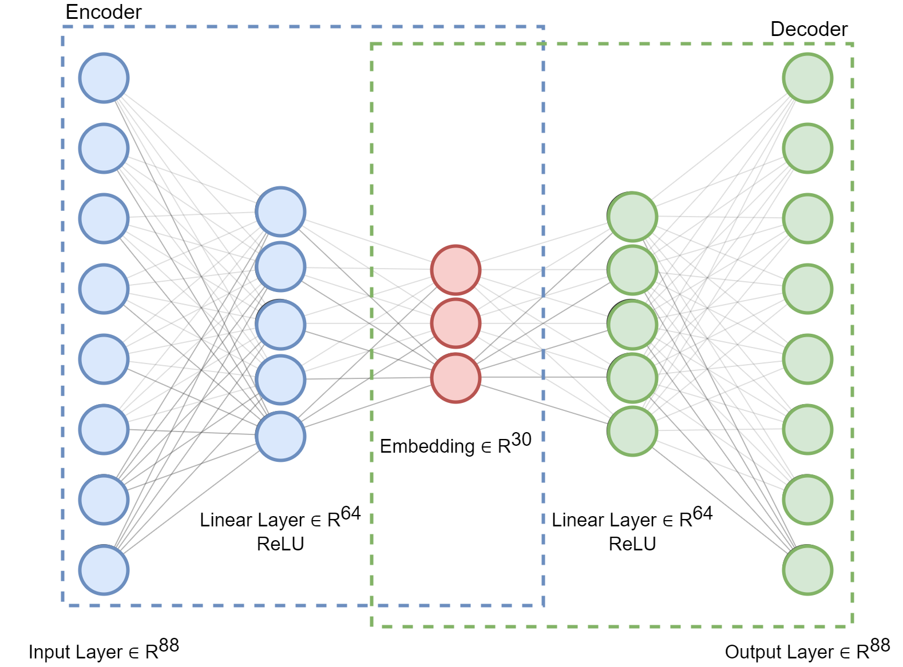

## [Link to repository]()
## [Link to paper]()

 

## Goals
 <b>> Find representations (embeddings) of microregions with respect to their road network characteristics </b>

<b>> Define a typology of such regions</b>

 

## Data
### OSM

### Road Network

### Used Cities

### Features

| Tag | Description |
| --- | ----------- |
| oneway | whether the road is one-way |
| highway | rank of the road |
| surface | physical surface, structure, composition |
| maxspeed | maximum legal speed limit |
| lanes | number of traffic lanes |
| bridge | type of bridge that the way is on |
| junction | type of junction that the way forms itself |
| access | restrictions on the use |
| tunnel | type of an underground passage |
| width | actual width of a way |

 

## Microregions
Used [Uber's H3](https://h3geo.org/) (hexagonal hierarchical geospatial indexing system).

 

## highway2vec

### Autoencoder

### Aggregation

 

## Results
### <b>Typology</b>
|  | Color | Description |
| ---: | ----------- | ---- |
| 0 | blue | high-capacity regions containing arterial roads |
| 1 | light blue | residential, paved regions with good quality of road infrastructure |
| 2 | orange | residential, unpaved regions with low quality of road infrastructure |
| 3 | light orange | regions complementing main road network |
| 4 | green | high-capacity, high-speed regions and bypasses |
| 5 | light green | estate regions and connectors |
| 6 | red | motorways |
| 7 | light red | traffic collectors and connectors |

### <b>Microregions</b>
| City | Typology | 
| --- | ----------- | 
| Bydgoszcz |  |
| Cracow |  |
| Poznan |  |
| Tricity |  |
| Warsaw |  |
| Wroclaw |  |

### <b>Latent Space</b>
t-SNE

| City | Latent space projected into RGB | 
| --- | ----------- | 
| Bydgoszcz |  |
| Cracow |  |
| Poznan |  |
| Tricity |  |
| Warsaw |  |
| Wroclaw |  |

### <b>Operations in latent space</b>

| Summand | Summand | Result |
| --- | ----------- | --- |
| High-traffic region containing a bridge | Residential region | Residential area next to high-traffic roads |
|  |  | 

 

## Appendix
### City feature occurance
